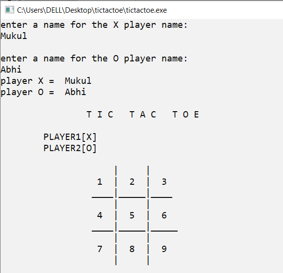
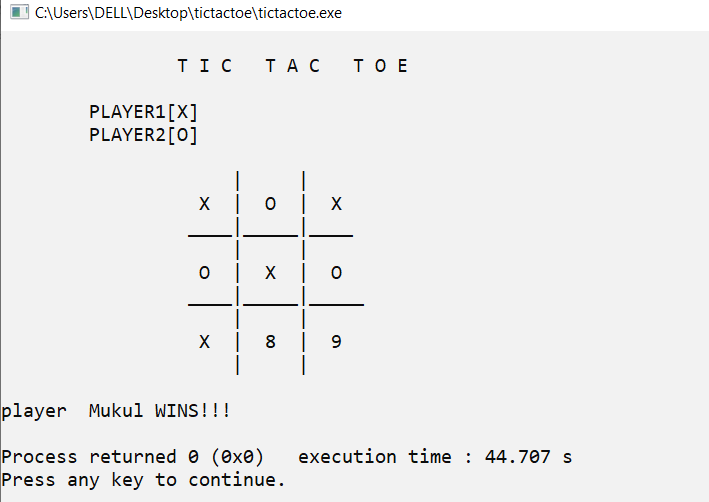
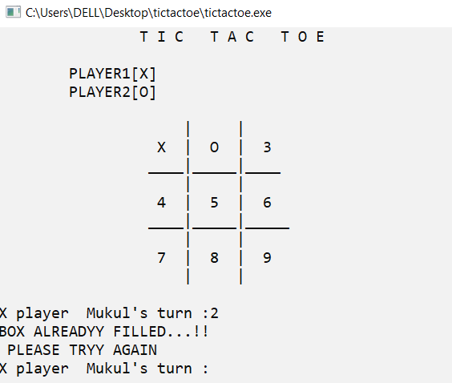
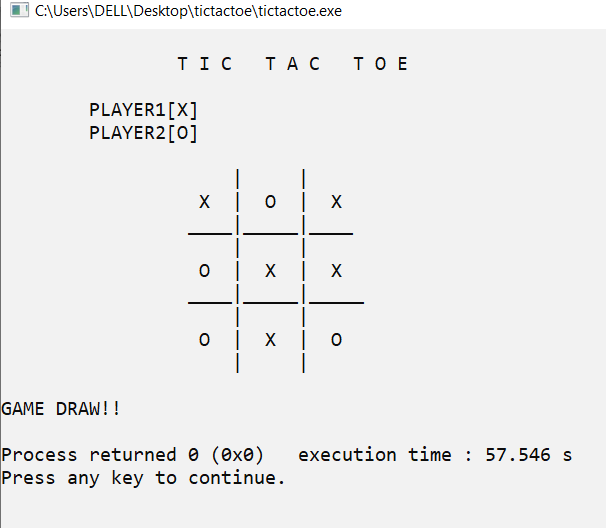

# Tic-Tac-Toe_Game
# A Basic C++ Tic Tac Toe Board Game

# Objective
This is the project on popular Tic-Tac-Toe Game. This game is fairly simple by itself. In this game, there is a board with n x n squares. In this project, it is 3 x 3 board. It is a two player game.One of the player chooses ‘O’ and the other ‘X’ to mark their respective cells.The moves are chosen by both the players alternatively. First player who fill its three same symbols in a row - horizontally, vertically or diagonally - on a 3 x 3 grid, wins the game. If no one wins, then the game is said to be draw.

# Logic 
* The game is to be played between two people (in this program between two persons).    
* One of the player chooses ‘O’ and the other ‘X’ to mark their respective cells.       
* The game starts with one of the players and the game ends when one of the players has one whole row/ column/ diagonal filled with his/her respective character (‘O’ or ‘X’) or If no one wins, then the game is said to be draw.

# Requirement
## Hardware Requirements
* Processor – x86, x86_64.    
* 32 kB main memory (RAM).    
* 384 kB secondary memory. (Hard Disk)   
* Monitor for display.    
* Keyboard for input.    
## Software Requirements
* Basic operating system such as windows, Linux , UNIX, DOS, and many others.    
* For windows based system- installed C/C++ compiler, GNU/G++, Mingw or Cygwin.    
* Installed shell prompt, preferably PowerShell for Windows system, Bash for Linux, BSD and Max OS.    
* Xterm shell in case of Linux users on an Integrated Development Environment such as Code::Blocks.    
* Systems driver for display and input (keyboard), as well as proper input/output channel cal libration on a system-wide scale  

# Screenshot
## Enter the name of the Players

## Win Match

## Box All Ready Filled and try again

## Draw Match

